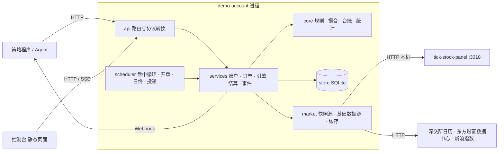
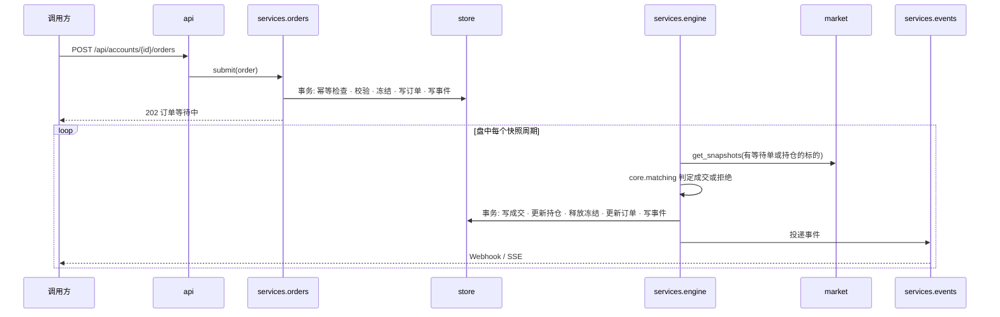

# 实现

本文档说明已确认的方案在技术上怎样落地：运行形态、架构、模块划分、数据模型、公共接口、关键技术流程、外部依赖的调用策略和工程保障。项目级技术选型已于 2026-09-24 至 2026-09-28 由发起者确认：后端 Python + FastAPI，存储 SQLite 单文件，控制台 React + TypeScript + Vite + Ant Design + ECharts；行情主源是发起者本机运行的 tick-stock-panel（下称 TSP），TSP 没有的交易日历、停复牌和股票分红送转明细用免费公开接口补，ETF 的除权除息用 TSP 的复权因子处理。其余由 AI 做出的重要选择集中列在 8.5 AI 自行决定的选择。

目录

1. 系统设计：1.1 运行形态与技术边界 · 1.2 整体架构 · 1.3 模块与职责 · 1.4 核心执行链 · 1.5 仓库结构
2. 领域核心 core：2.1 金额与精度 · 2.2 标的与交易规则 · 2.3 撮合判定 · 2.4 台账重放 · 2.5 统计
3. 行情与基础数据 market：3.1 接口抽象 · 3.2 TSP 适配器 · 3.3 公开接口适配器 · 3.4 参考数据缓存与日历服务 · 3.5 Mock 源
4. 持久化 store：4.1 SQLite 约定 · 4.2 数据模型 · 4.3 事务边界 · 4.4 迁移
5. 服务层 services：5.1 账户 · 5.2 订单 · 5.3 撮合引擎 · 5.4 日终结算 · 5.5 事件与通知 · 5.6 调度与时钟
6. 对外接口 api：6.1 通用约定 · 6.2 接口清单 · 6.3 Webhook 与 SSE
7. 网页控制台 frontend
8. 工程保障：8.1 测试 · 8.2 配置、日志与告警 · 8.3 运行与部署 · 8.4 工程规范 · 8.5 AI 自行决定的选择 · 8.6 里程碑

---

## 1. 系统设计

本章说明系统整体由什么组成、各部分负责什么、一笔订单经过哪些模块。

### 1.1 运行形态与技术边界

- **单进程**：一个 Python 进程同时提供 HTTP 接口、托管控制台静态文件、运行盘中撮合与日终结算的后台任务。单人自用，不做水平扩展。
- **本地运行**：`uv run demo-account serve`，默认监听 127.0.0.1:8770（TSP 占用 3018 和 3011，其开发脚本会清理这两个端口，本项目避开）；数据文件默认 `data/demo_account.sqlite3`。
- **外部依赖**：TSP（行情快照、日线、指数日线、标的信息）通过其本地 HTTP 接口读取；深交所（交易日历）、东方财富数据中心（停复牌、股票分红送转）和新浪（沪深 300 兜底）通过公开 HTTP 接口读取。三者都经由可替换的接口接入；测试与开发用确定性的 Mock 源。
- **版本**：Python 3.12，uv 管理依赖；Node 24，pnpm 管理前端。
- **网络**：本机系统代理会拦截部分行情主机，HTTP 客户端默认不读取系统代理设置（`trust_env=False`），可用配置打开。

### 1.2 整体架构



分层原则：core 只有纯函数和数据类，不做任何 IO；services 编排 core、store 和 market；api 只做协议转换和参数校验；scheduler 只决定"什么时候调用哪个 service"。

### 1.3 模块与职责

| 模块 | 职责 | 依赖 |
|---|---|---|
| core | 金额精度、标的与板块规则、涨跌停价、交易时段与订单所属交易日、申报数量、费用、成交价、冻结金额、台账重放、回合统计 | 无 |
| market | 快照源与基础数据源的接口抽象、TSP 适配器、公开接口适配器、Mock 源、参考数据缓存与日历服务 | core、store |
| store | SQLite 连接、迁移、各表的读写 | 无 |
| services | 账户、订单校验与冻结、撮合引擎、日终结算、事件与通知、市场状态 | core、store、market |
| scheduler | 时钟抽象、后台循环、启动补跑 | services |
| api | FastAPI 路由、请求响应模型、错误映射、鉴权、静态文件 | services |
| frontend | 控制台页面 | api |

### 1.4 核心执行链



日终结算由 scheduler 在 16:00 触发，按 5.4 日终结算的步骤在每个账户各自的事务中完成，结束时写结算完成事件。

### 1.5 仓库结构

```text
demo-account/
├── docs/                         蓝图
├── backend/
│   ├── pyproject.toml            uv 管理，包名 demo_account
│   ├── src/demo_account/
│   │   ├── main.py               FastAPI 应用工厂
│   │   ├── cli.py                demo-account serve / settle / reconcile / verify-tsp
│   │   ├── config.py             Settings
│   │   ├── clock.py              Clock 协议、SystemClock、FakeClock
│   │   ├── core/                 money · instruments · rules · fees · matching · ledger · stats · models
│   │   ├── market/               base · tsp_source · public_source · mock_source · reference · calendar
│   │   ├── store/                db · repos · migrations/*.sql
│   │   ├── services/             accounts · orders · engine · settlement · events · market_status
│   │   ├── scheduler.py
│   │   ├── verify_tsp.py         TSP 接入验证：逐项检查接口与数据，用临时库跑通完整流程，输出报告与原始样本
│   │   └── api/                  deps · errors · schemas · accounts · orders · portfolio · market · events · admin · static
│   ├── scripts/seed_mock.py      用假时钟与 Mock 行情生成演示历史
│   └── tests/
├── frontend/                     Vite + React 控制台，构建产物 dist/ 由后端托管
├── data/                         运行时数据，不入库
├── .claude/launch.json           Mock 预览的启动配置
├── .env.example
└── README.md
```

---

## 2. 领域核心 core

本章定义不依赖 IO 的规则与算法，是所有金融口径的唯一实现处，其他模块只能调用，不得重复实现。

### 2.1 金额与精度

- 价格、金额、费率一律用 `Decimal`；禁止 `float` 参与任何金额计算。外部数据源给的浮点价格在适配器边界转成 `Decimal` 并按最小变动单位取整。
- 最小变动单位：股票 0.01 元，ETF 0.001 元；金额精确到分。
- 取整：费用和金额按分四舍五入（half-up）；滑点后的成交价按最小变动单位向不利方向取整（买入向上、卖出向下）；涨跌停价按最小变动单位 half-up，与交易所一致。
- 数量为整数股。

### 2.2 标的与交易规则

- **代码格式**：`600000.SH`、`000001.SZ`、`510300.SH`，与 TSP 一致。`.BJ` 一律拒绝。
- **资产类型**：stock 或 etf，来自参考数据（3.4 参考数据缓存与日历服务）。
- **板块**：`688`、`689` 开头为科创板；`300`、`301` 开头为创业板；其余沪深股票为主板；ETF 按主板规则，20% 幅度的 ETF 通过配置清单指定。
- **申报数量**：主板、创业板、ETF 买入 100 股整数倍；科创板买入不少于 200 股、超过部分 1 股递增；卖出允许零股一次卖出；单笔上限按需求跨角色规则 1.3 申报数量。
- **涨跌幅**：主板 10%（含风险警示股），创业板与科创板 20%；新股上市前 5 个交易日不设限（按上市日与交易日历计算交易日序号）。涨跌停价优先取参考数据中的行情源值，缺失时按公式计算。
- **风险警示股**：名称含 ST 或 *ST；`st_order_allowed(order_type, has_protect_price)` 只允许限价单和带保护限价的收盘单；`st_daily_buy_cap = 500000` 股。
- **交易时段**：`session_of(now, is_trading_day)` 返回 pre_open、opening_auction（9:15 至 9:25）、continuous（9:30 至 11:30、13:00 至 14:57）、lunch、closing_auction（14:57 至 15:00）、after_hours（15:05 至 15:30）、closed。
- **订单归属**：`assign_trade_date(order_type, now, calendar)` 按方案 3.2 下单的表决定所属交易日：即时单只在 continuous 时段可提交且属于当日；限价单 15:00 前属于当日，其余属于下一交易日；开盘单 9:25 前属于当日；收盘单 15:30 前属于当日。

### 2.3 撮合判定

纯函数，输入订单、快照或价格、账户费用参数，输出成交价或拒绝原因：

- `market_fill_price(ref_price, side, slippage, tick, up_limit, down_limit)`：即时单与开盘单的成交价。
- `limit_can_fill(last, limit_price, side)`：限价单是否触及。
- `limit_hit(ref_price, side, up_limit, down_limit)`：是否触及涨跌停导致拒绝。
- `close_fill(close, side, protect_price)`：收盘单是否成交（保护限价判定），成交价为收盘价。
- `freeze_amount(qty, freeze_price, fee_params, asset_type)`：冻结金额，含按冻结价估算的费用。
- `amount_to_qty(amount, freeze_price, board, asset_type)`：按金额折算数量。

### 2.4 台账重放

`replay(fills) -> LedgerState`：按序号顺序处理成交记录，得到每个标的的数量、可卖数量、今日买入、总成本，以及现金。交易记录按方向增减；公司行动记录调整数量与成本或增加现金；冲正记录按其内容反向处理。结算核对与管理接口的重建都调用它，持仓表只是它的物化结果。

### 2.5 统计

- FIFO 配对：按标的维护买入批次队列，卖出成交依次消耗最早批次，生成回合；批次成本含买入费用，卖出净额扣卖出费用。
- 最大回撤：基于每日定版净值序列。
- 年化收益：`(nav ** (365 / 自然日数)) - 1`，账龄不足 30 天不计算。
- 输出：胜率、盈亏比、平均持有交易日、最大回撤、累计收益、年化收益、回合明细。

---

## 3. 行情与基础数据 market

本章说明外部数据怎样进入系统，以及限流、缓存和失败时的行为。

### 3.1 接口抽象

- `QuoteSource.get_snapshots(symbols) -> dict[str, Snapshot]`。`Snapshot` 字段：symbol、ts（北京时间）、last、open、high、low、prev_close、halted、up_limit（可空）、down_limit（可空）、source。任何字段缺失或价格非正数的快照在源内部就被丢弃。
- `ReferenceDataSource`：`trading_calendar(year)`、`instrument(symbol)`、`daily_bars(symbol, start, end)`、`price_limits(symbol, date)`、`suspensions(date)`、`corporate_actions(symbol)`、`index_daily(code, start, end)`。一个组合实现把各方法路由到 TSP 适配器或公开接口适配器（见 3.2、3.3）。
- 两个接口都是同步调用，由 services 在线程池中执行，避免阻塞事件循环。HTTP 客户端统一用 httpx，超时 10 秒，`trust_env` 按配置。

### 3.2 TSP 适配器

TSP 是行情主源，只读它的本地缓存接口，不触发它向上游拉数。

| 需要 | TSP 接口 | 取法 |
|---|---|---|
| 市场状态与快照时间 | `GET /api/intraday/status` | 每个周期取一次；`realtime_allowed` 或 `enabled` 为假时视为源不可用；`is_polling_window` 为真而 `last_fetch_ms` 早于 10 分钟时视为行情停滞，本轮失败 |
| 快照（最新价、今开、最高、最低） | `GET /api/kline/daily/latest?symbol=` | 逐标的调用；`row.is_live` 为真且 `row.date` 等于今天才算有效；`ts` 取 `last_fetch_ms`；前收盘价由 `change_pct` 反推，仅用于展示 |
| 前收盘价、涨跌停价 | 不调用 TSP | 前收盘价取自已缓存的日线；涨跌停价按 2.2 标的与交易规则计算。TSP 的分时接口在缓存未命中时会向其上游拉数，避免占用 TSP 的行情额度 |
| 日线（收盘、开盘、复权） | `GET /api/kline/daily?symbol=&start_date=&end_date=` | `raw_close` 为未复权收盘价用于结算与估值；`close` 为前复权价，两者比值用于 ETF 复权因子；开盘、最高、最低价按比值还原；TSP 注入的盘中实时蜡烛（`is_live`）一律丢弃，结算只用收盘后落盘的日线 |
| 指数日线（沪深 300） | `GET /api/index/daily?symbol=000300.SH&start_date=&end_date=` | 取 `close`；无数据时用 3.3 的新浪兜底 |
| 标的信息 | `GET /api/kline/instruments/search?q=<代码>&asset_types=stock,etf` | 取代码完全匹配的一条；名称判 ST；`asset_type` 判 stock 或 etf。TSP 不提供上市日：近 40 个自然日内日线不超过 5 根时，以首根日线日期作为上市日估计 |

- **停牌判断**：TSP 会把停牌标的从当日快照中剔除，因此"市场开市但该标的无当日有效快照"视为无行情；是否停牌由 3.3 的停复牌名单决定。
- **鉴权**：TSP 未设密码时本机直接访问；设了密码则用 `DEMO_ACCOUNT_TSP_PASSWORD` 调 `POST /api/auth/login` 取 `tf_session` cookie，收到 401 或 403 时重新登录一次。
- **运行前提**（写入 README）：TSP 已配置能提供实时行情的数据源；交易 ETF 时需在 TSP 开启 ETF 实时与日线拉取；TSP 已同步指数列表。
- **失败处理**：请求失败或超时本轮跳过，连续失败超过 5 次置源为不可用并告警；不可用期间不撮合即时单与限价单（超时规则照常），健康接口显示状态。

### 3.3 公开接口适配器

| 需要 | 来源 | 取法与频率 |
|---|---|---|
| 交易日历 | 深交所 `www.szse.cn/api/report/exchange/onepersistenthour/monthList?month=YYYY-MM` | 按月返回每天的 `jyrq`（日期）与 `jybz`（1 交易、0 休市），沪深两市共用；逐月拉取一年，某月无数据表示尚未公布，覆盖范围截至最后一个有数据的月份；启动时和每日 8:30 检查，同一年份每天最多拉取一次，写入 trading_calendar |
| 停复牌名单 | 东方财富数据中心 `RPT_CUSTOM_SUSPEND_DATA_INTERFACE`，按日期过滤 | 按日期查询会带出近几天已结束的记录，因此按起止时间判定：停牌开始不晚于当日 15:00，且结束为空或不早于当日 15:00，才算当日停牌；盘中临时停牌不算。每日 8:30 和结算前各取一次，写入 suspensions |
| 股票分红送转 | 东方财富数据中心 `RPT_SHAREBONUS_DET`，按证券代码过滤 | 只取 `ASSIGN_PROGRESS` 含"实施"且有除权除息日、除权日在近 400 天内的记录；`BONUS_RATIO`、`IT_RATIO` 为每 10 股送、转股数（两者都为空时用 `BONUS_IT_RATIO` 作送股），`PRETAX_BONUS_RMB` 为每 10 股税前派现，`EX_DIVIDEND_DATE`、`EQUITY_RECORD_DATE`、`PAY_CASH_DATE` 为除权日、登记日、派息日，派息日为空时按除权日入账；每日 8:30 对有持仓和等待中订单的股票各取一次，写入 corporate_actions |
| 沪深 300 兜底 | 新浪 `CN_MarketDataService.getKLineData?symbol=sh000300&scale=240` | 仅当 TSP 无指数数据时使用 |

- **限流与退避**：每个来源串行请求，间隔不低于 0.5 秒；HTTP 429 或 5xx 按 1s、2s、4s 退避重试 3 次。
- **接口变动**：响应字段缺失或结构不符时记录告警并视为本次失败，不猜测字段含义；日历失败时沿用数据库中已有日历，已有日历也未覆盖当前日期时按方案 8.4 不撮合不结算。

### 3.4 参考数据缓存与日历服务

参考数据落到 store 的 trading_calendar、instruments、daily_bars、suspensions、corporate_actions、benchmark_daily 表，services 只读缓存不直连数据源。`CalendarService` 提供 `is_trading_day`、`next_trading_day`、`prev_trading_day`、`trading_day_rank(list_date, date)`；日历未覆盖目标日期时抛出明确错误，调用方按方案 8.4 告警。

**ETF 复权因子**：TSP 适配器对 ETF 取近 20 个自然日的日线，比较相邻两个交易日的 `raw_close / close` 比值，比值变化不小于 0.1% 即视为后一日发生除权除息（更小的变化视为前复权价的取整噪声），因子 f = 前一日比值 / 当日比值，作为来源为 tsp-factor 的公司行动写入 corporate_actions；结算时数量按 f 调整并向下取整，不足 1 份的部分按当日收盘价折成现金入账，总成本不变。TSP 没有复权因子来源时比值恒为 1，无法识别 ETF 除权除息，结算时对持有 ETF 的账户写一条告警。

### 3.5 Mock 源

`MockQuoteSource` 与 `MockReferenceSource` 由种子生成确定性的价格路径、日历、涨跌停价、停牌和公司行动，配合 `FakeClock` 在测试中推进时间；`DEMO_ACCOUNT_MARKET=mock` 时整个服务用 Mock 源运行，用于本地开发控制台。

---

## 4. 持久化 store

本章定义 SQLite 的使用约定、表结构、事务边界和迁移方式。

### 4.1 SQLite 约定

- 单文件，`journal_mode=WAL`，`foreign_keys=ON`，`busy_timeout=5000`。
- 标准库 `sqlite3`，不用 ORM；SQL 集中在 store 的仓储函数中。
- 进程内单写者：所有写事务通过一把锁串行，并以 `BEGIN IMMEDIATE` 开始；读不加锁。
- 金额用 TEXT 保存 `Decimal` 字符串；数量 INTEGER；时间 ISO 8601 带 `+08:00`；日期 `YYYY-MM-DD`；布尔 INTEGER；JSON 用 TEXT。
- 主键：账户 `acc_` 加 8 位十六进制；订单 `ord_` 加时间前缀与 6 位随机；成交用全局自增序号；事件用账户内递增序号。

### 4.2 数据模型

| 表 | 关键列 | 说明 |
|---|---|---|
| accounts | id, name, note, initial_cash, commission_rate, min_commission, slippage_rate, block_st, status, webhook_url, webhook_secret, created_at, updated_at | 账户与当前费用参数；参数变更历史在 events 中 |
| orders | id, account_id, symbol, side, order_type, qty, amount, limit_price, protect_price, idempotency_key, note, tags, trade_date, defer_count, status, reason_code, reason, frozen_cash, frozen_qty, created_at, finished_at；唯一索引 (account_id, idempotency_key) | 订单 |
| fills | seq, account_id, order_id, symbol, kind(trade/corporate_action/reversal), side, qty, price, gross_amount, commission, stamp_tax, transfer_fee, cash_delta, trade_date, occurred_at, note | 成交台账，只插入 |
| positions | account_id, symbol, qty, today_bought_qty, cost_total, updated_at | 物化持仓；可卖数量 = qty − today_bought_qty，不单独存储 |
| nav_daily | account_id, trade_date, cash, market_value, total_assets, nav, day_pnl, benchmark_nav, finalized_at | 每日定版净值 |
| events | account_id, seq, type, occurred_at, order_id, fill_seq, trade_date, symbol, basis, summary, payload, notify, delivered_at, attempts, next_attempt_at；主键 (account_id, seq) | 账户事件序列，兼做通知投递队列；basis 为当时依据的 JSON |
| settlement_runs | trade_date, status, started_at, finished_at, error | 结算幂等与状态 |
| instruments | symbol, name, asset_type, board, exchange, list_date, is_st, updated_at | 参考数据 |
| trading_calendar | cal_date, is_open, source | 交易日历 |
| daily_bars | symbol, trade_date, open, high, low, close, adj_close, prev_close, volume, up_limit, down_limit | 日线：close 为未复权收盘价，adj_close 为 TSP 前复权价 |
| suspensions | symbol, trade_date, reason, source | 当日停牌名单 |
| corporate_actions | symbol, ex_date, record_date, pay_date, bonus_per_share, transfer_per_share, cash_per_share, factor, source, applied_at | 股票分红送转明细与 ETF 因子 |
| benchmark_daily | index_code, trade_date, close, source | 基准指数 |
| alerts | id, level, code, message, trade_date, created_at, resolved_at | 告警 |

冻结资金不单独建表：账户可用现金 = 台账推导的现金 − 等待中订单的 frozen_cash 之和；可卖数量同理由 positions 与等待中卖单的 frozen_qty 计算。风险警示股当日累计买入 = 当日该标的买入成交数量 + 等待中买单数量。

### 4.3 事务边界

- 下单：幂等检查、校验、冻结计算、写订单、写事件在一个事务内。
- 成交：写 fills、更新 positions、更新 orders 状态与冻结、写 events 在一个事务内；一笔订单一个事务。
- 结算：每个账户一个事务完成方案 4.4 日终结算的全部步骤；settlement_runs 在开始时写 running、结束时写 done 或 failed。
- 账户管理：状态与参数变更和对应事件在一个事务内；冻结账户时连同撤销全部等待单。
- 核对：只读，不在事务内修改数据。

### 4.4 迁移

`store/migrations/NNN_name.sql` 按序号执行，`PRAGMA user_version` 记录已应用版本，启动时自动迁移；只允许新增迁移，不修改已发布的迁移文件。

---

## 5. 服务层 services

本章按核心执行链的顺序说明各服务的职责、机制和错误处理。

### 5.1 账户

创建、修改名称备注与费用参数、冻结、恢复、归档，每个动作写对应事件（费用参数变更的 basis 记录变更前后的值）。冻结在同一事务内把该账户所有等待中订单置为已撤销并释放冻结，逐单写撤销事件。归档不可逆。查询概览时按 4.2 数据模型的口径计算可用现金与总资产。估值价按顺序取：当日结算已完成时用当日定版收盘价；否则用当日有效快照；再否则用上一交易日及以前的最近收盘价（即前收盘价）。不读当日尚未定版的日线，避免 Mock 源提前生成的当日收盘价泄露到盘中估值。

### 5.2 订单

`submit(account_id, request)` 按方案 4.1 下单与校验的顺序执行，每一步失败返回带错误码的拒绝并写订单拒绝事件；通过后计算所属交易日、冻结价、冻结金额或数量，写入等待中订单和订单提交事件，事件 basis 含校验所用的前收盘价、涨跌停价、快照价与时间、停牌与风险警示状态。`preview(account_id, request)` 执行同样的校验与冻结计算但不落库，供控制台预估。撤单只对等待中订单生效，释放冻结并写事件。幂等：唯一索引冲突时返回已存在的订单。

### 5.3 撮合引擎

- `run_intraday_cycle()`：收集等待中即时单和限价单的标的加上有持仓的标的，向 market 取快照并写入内存快照缓存（供估值与查询），对每笔等待单按方案 4.2 盘中撮合判定；成交或拒绝各自在一个事务内落库并写事件（basis 为所用快照）。快照时间早于订单创建时间的不用于该订单。
- `run_open_matching()`：交易日 9:30 后，对所属交易日为今天的开盘单，取快照中 `open` 大于 0 的第一笔按方案 4.3 开盘撮合处理；当日一直取不到开盘价的订单留到结算时按停牌顺延。
- 两个入口都是幂等的：已处理的订单不会再次处理；调用重叠时后一次直接返回。

### 5.4 日终结算

`settle(trade_date)`：检查 settlement_runs 防重复；拉取当日日线、指数、公司行动与停牌数据，缺失则写 failed 与告警后返回；然后对每个非归档账户在一个事务内执行方案 4.4 的步骤：撮合收盘单（含保护限价判定与 15:00 仍停牌的顺延）、失效过期订单、公司行动（股票按 corporate_actions 明细，ETF 按 3.4 的因子）、T+1 解锁、净值定版、回合统计缓存，每一步写事件；全部账户完成后写 done 并写结算完成事件。顺延不单独产生事件：每个账户当日的收盘单成交、订单失效、订单顺延与公司行动汇总写入该账户结算完成事件的 payload（filled、expired、rejected、deferred、corporate_actions）。送转与分红的应得数量按登记日（缺失时取除权日前一交易日）为止的台账重放确定，不足 1 股的部分按除权日收盘价折成现金。结算后调用 `reconcile(account_id)` 用 2.4 台账重放核对持仓与现金，不一致写告警。启动补跑：找出上次 done 之后到当前应结算的所有交易日，顺序调用 `settle`，期间 api 对下单返回"结算补跑中"。

### 5.5 事件与通知

`emit(account_id, type, basis, payload)` 在业务事务内写 events（账户内序号取当前最大值加一，`notify` 按方案 3.5 事件通知的范围置位），事务提交后广播到进程内订阅者（SSE）并唤醒投递工作线程。投递工作循环取 `notify` 为真、`delivered_at` 为空、`next_attempt_at` 已到、`attempts` 小于 5 的事件，向账户的 webhook_url 发送 POST，成功写 delivered_at，失败按 10 秒、30 秒、2 分钟、10 分钟、30 分钟安排下一次；5 次失败后停止并写告警。未配置 webhook 的账户只保留事件供拉取。

### 5.6 调度与时钟

- `Clock` 协议提供 `now()`（北京时间，固定 UTC+8）；`SystemClock` 用系统时间，`FakeClock` 供测试推进。
- scheduler 是一个 asyncio 任务，按北京时间计划：8:30 刷新参考数据（日历、当日停复牌、有关标的的信息、涨跌停价与分红送转）；9:30 起在连续竞价时段内按快照周期循环执行盘中撮合，并在开盘后执行开盘撮合；16:00 执行结算，失败后每 30 分钟重试到 23:00；投递工作循环常驻。
- 时钟校验：公开接口（深交所、东方财富、新浪）响应的 Date 头与本机时间偏差超过 60 秒时，下单接口返回时钟异常错误并写告警，偏差恢复后自动解除；TSP 与本服务同机运行，不用于比对。TSP 正在轮询但 `last_fetch_ms` 早于 10 分钟时按 3.2 视为行情停滞，连续失败触发行情源告警。

---

## 6. 对外接口 api

本章定义程序调用方和控制台共用的 HTTP 接口。

### 6.1 通用约定

- 前缀 `/api`，JSON 请求与响应；金额为字符串，数量为整数，时间为 ISO 8601 带 `+08:00`，日期为 `YYYY-MM-DD`。
- 枚举值：方向 `buy`、`sell`；订单类型 `market`、`limit`、`open`、`close`；订单状态 `pending`、`filled`、`rejected`、`cancelled`、`expired`；账户状态 `active`、`frozen`、`archived`；事件类型 `order_submitted`、`order_rejected`、`order_filled`、`order_cancelled`、`order_expired`、`settlement_done`、`corporate_action`、`reversal`、`account_created`、`account_frozen`、`account_unfrozen`、`account_archived`、`fee_params_changed`。
- 鉴权：配置 `DEMO_ACCOUNT_API_KEY` 时所有 `/api` 请求需带 `X-API-Key` 头；未配置则不鉴权。
- 错误：`{"error": {"code": "...", "message": "...", "details": {...}}}`。校验类错误 400，不存在 404，状态冲突 409，结算补跑中 503。错误码与方案的拒绝原因一一对应：`ACCOUNT_NOT_ACTIVE`、`SYMBOL_UNSUPPORTED`、`SYMBOL_INFO_MISSING`、`SYMBOL_SUSPENDED`、`ST_BLOCKED`、`ST_ORDER_TYPE_NOT_ALLOWED`、`ST_DAILY_BUY_LIMIT`、`OUTSIDE_SESSION`、`LOT_SIZE`、`QTY_LIMIT`、`PRICE_OUT_OF_LIMIT`、`PRICE_TICK`、`INSUFFICIENT_CASH`、`INSUFFICIENT_SELLABLE`、`ORDER_NOT_PENDING`、`CLOCK_SKEW`、`SETTLEMENT_CATCHUP`、`CALENDAR_UNAVAILABLE`；以及通用的 `INVALID_REQUEST`、`UNAUTHORIZED`、`ACCOUNT_NOT_FOUND`、`ORDER_NOT_FOUND`、`ACCOUNT_NOT_FROZEN`、`NOT_TRADING_DAY`。
- 下单校验失败：订单以 rejected 落库并写订单拒绝事件，接口返回错误响应，HTTP 400（账户状态问题 409），错误码即拒绝原因，`details.order` 为该订单。请求结构不合法（如数量与金额都缺）直接返回 400 INVALID_REQUEST，不形成订单。
- 订单原因码：撮合与结算阶段的拒绝、失效与撤销写在订单的 reason_code：`PRICE_LIMIT_HIT`（触及涨跌停）、`SYMBOL_SUSPENDED`（停牌）、`MARKET_DATA_MISSING`（即时单等待行情超时）、`EXPIRED_AT_CLOSE`（所属交易日收盘未成交）、`DEFER_LIMIT`（停牌顺延超限）、`PROTECT_PRICE_NOT_MET`（收盘单保护限价未满足）、`INSUFFICIENT_CASH`、`INSUFFICIENT_SELLABLE`（成交时不足）、`CANCELLED_BY_USER`、`ACCOUNT_FROZEN`、`ACCOUNT_ARCHIVED`（撤销原因）。
- 列表接口用 `limit`（默认 100，最大 1000）与 `offset` 分页，按时间倒序；事件接口按序号正序。

### 6.2 接口清单

| 方法与路径 | 用途 |
|---|---|
| POST /api/accounts | 创建账户 |
| GET /api/accounts | 列表，默认不含归档 |
| GET /api/accounts/{id} | 账户详情与概览（含估算市值） |
| PATCH /api/accounts/{id} | 改名称、备注、费用参数、ST 限制 |
| POST /api/accounts/{id}/freeze、/unfreeze、/archive | 状态转换 |
| PUT /api/accounts/{id}/webhook | 设置回调地址与签名密钥 |
| GET /api/accounts/{id}/positions | 持仓 |
| POST /api/accounts/{id}/orders | 下单（含备注、标签、保护限价、幂等键），返回 202 与订单；校验失败见 6.1 |
| POST /api/accounts/{id}/orders/preview | 预估冻结金额与费用 |
| GET /api/accounts/{id}/orders | 订单列表，可按 status、symbol、from、to 过滤 |
| GET /api/accounts/{id}/orders/{order_id} | 订单详情 |
| DELETE /api/accounts/{id}/orders/{order_id} | 撤单 |
| GET /api/accounts/{id}/fills | 成交台账 |
| GET /api/accounts/{id}/nav | 每日定版净值与基准 |
| GET /api/accounts/{id}/stats | 回合统计 |
| GET /api/accounts/{id}/events?after=&types=&symbol=&from=&to= | 拉取事件序列，每条带 basis |
| GET /api/market/status | 是否交易日、当前时段、下次开盘与收盘、数据源健康 |
| GET /api/market/instruments?q= | 按代码或名称搜索标的 |
| GET /api/market/instruments/{symbol} | 标的信息、前收、涨跌停价、停牌、ST、板块 |
| GET /api/market/quotes?symbols= | 最新快照（缓存） |
| GET /api/events/stream | SSE，全部账户事件与告警，供控制台 |
| POST /api/admin/settle?date= | 手动触发结算 |
| POST /api/admin/match | 立即执行一次开盘撮合与盘中撮合，供调试与 Mock 演示 |
| POST /api/admin/reconcile/{id} | 台账重放核对 |
| GET /api/admin/alerts | 告警列表，可含已解决 |
| POST /api/admin/alerts/{id}/resolve | 标记告警已解决 |
| GET /api/admin/settlements | 最近的结算记录 |
| GET /api/health | 进程、数据源、最近快照时间、最近结算日 |
| GET / | 控制台静态文件，未知路径回退 index.html |

### 6.3 Webhook 与 SSE

Webhook 请求：`POST webhook_url`，JSON 体 `{event_id, account_id, seq, type, occurred_at, basis, data}`，头 `X-Demo-Account-Event: <type>`；配置密钥时加 `X-Demo-Account-Signature: sha256=<HMAC-SHA256(body)>`；超时 5 秒，2xx 视为成功。SSE 每条消息的 `event` 为事件类型、`data` 为同样的 JSON；连接建立时可带 `Last-Event-ID` 补发。

---

## 7. 网页控制台 frontend

- 技术栈：React 18、TypeScript、Vite、Ant Design 5、ECharts（echarts-for-react）、TanStack Query、React Router、dayjs。
- 目录：`src/api`（types 接口类型、client 请求封装与错误、endpoints 接口清单、queries 查询钩子与查询键）、`src/pages`（OverviewPage、AccountPage、ReplayPage）、`src/components`（AppHeader、AlertsDrawer、AccountSummary、NavChart、PositionsTable、OrdersTable、FillsTable、StatsPanel、EventTimeline、OrderForm、AccountForm、WebhookForm）、`src/hooks`（useEventStream、useDebouncedCallback）、`src/utils`（format 展示格式与中文标签、errors 错误文案）。
- 页面：总览页展示账户卡片与多账户净值对比图；账户页含概览、持仓、下单面板（调用 preview 显示冻结金额与费用）、订单与成交、净值与基准、统计；复盘页按账户展示事件时间线（按标的、时间、类型筛选，点开看 basis 与备注）和标有买卖点的净值曲线（买卖点由成交事件按日期聚合到净值曲线上，点击定位到时间线）；账户管理用弹窗。
- 实时更新：useEventStream 按事件类型订阅 SSE，账户事件使该账户的概览、持仓、订单、成交、净值、统计、事件查询失效，告警弹出提示并刷新告警数；SSE 断开时概览类查询每 15 秒轮询兜底。
- 告警：页头显示未解决告警数，点开抽屉可逐条标记已解决，落实方案 8.3 的显著提示。
- 显示约定：金额、价格一律按后端字符串显示，前端只做格式换算，不参与账务计算；涨红跌绿；佣金率与滑点在表单里按万分之填写，提交时换算为小数。
- 鉴权：浏览器 localStorage 的 `demo-account.apiKey` 有值时请求带 `X-API-Key`；EventSource 不能带自定义头，配置了接口密钥时实时推送不可用，退化为轮询。
- 开发：`pnpm dev` 启动 Vite，`/api` 代理到 127.0.0.1:8770；构建 `pnpm build`（`tsc -b` 加 `vite build`）产出 `dist/`，按依赖拆为 react、antd、echarts、query 与业务代码几个分块，后端启动时若存在则托管。
- 本地预览：仓库根目录 `.claude/launch.json` 以 Mock 行情、`data/mock.sqlite3`、5 秒快照周期启动后端并托管 `dist/`。
- 只依赖 6.2 接口清单中的接口，不直接访问数据源。

---

## 8. 工程保障

本章列出测试、配置、运行方式、规范、AI 自行决定的选择以及里程碑。

### 8.1 测试

- core：每条金融规则一组用例，覆盖方案 7.2 规则与 8. 异常与边界：申报数量与单笔上限、价格精度、涨跌停价、新股无涨跌停、费用（最低佣金、印花税单向、ETF 免税）、滑点方向与取整、冻结金额、按金额折算、保护限价判定、风险警示股订单类型与日买入上限、时段与所属交易日、FIFO 回合、回撤、年化。
- 台账性质测试：随机生成成交序列，`replay` 的结果必须等于逐笔更新的 positions 与现金。
- services：用 FakeClock 与 Mock 源驱动完整交易日：下单、盘中撮合、开盘撮合、限价触及、收盘单与保护限价、除权除息（股票明细与 ETF 因子）、T+1 解锁、净值定版、重复结算幂等、补跑、冻结撤单、幂等键、事件序列完整性（每个账务变更恰有一条事件）。
- market：TSP 与公开接口适配器用录制的响应样本做解析测试；字段缺失时必须报错而不是猜测。真实公开接口测试默认跳过，设置 `DEMO_ACCOUNT_LIVE_TESTS=1` 时运行。
- 接入验证：`demo-account verify-tsp` 在 TSP 所在机器上运行，检查 TSP 连通与鉴权、实时行情、标的、日线与未复权价、指数、公开接口与本机时钟，并在临时库里用上一个交易日的真实数据跑通开户、收盘单、结算与核对，交易时段内再验证即时单成交；结果写入 report.md、report.json 与 samples/，不含密码。它自身用模拟上游测试覆盖交易时段、收盘后、TSP 不可用与需要密码几种情形。
- api：FastAPI TestClient 覆盖每个接口的成功与错误码。
- frontend：`tsc -b` 与 `vite build` 通过；关键页面在本地用浏览器实际走一遍。
- 修 bug 先写复现测试。

### 8.2 配置、日志与告警

| 环境变量 | 含义 | 默认 |
|---|---|---|
| DEMO_ACCOUNT_DB_PATH | SQLite 文件路径，相对路径按仓库根目录解析 | data/demo_account.sqlite3 |
| DEMO_ACCOUNT_HOST、DEMO_ACCOUNT_PORT | 监听地址 | 127.0.0.1、8770 |
| DEMO_ACCOUNT_API_KEY | 接口鉴权密钥，空为不鉴权 | 空 |
| DEMO_ACCOUNT_MARKET | tsp 或 mock | tsp |
| DEMO_ACCOUNT_TSP_BASE_URL | TSP 地址 | http://127.0.0.1:3018 |
| DEMO_ACCOUNT_TSP_PASSWORD | TSP 登录密码，TSP 未设密码时留空 | 空 |
| DEMO_ACCOUNT_HTTP_TRUST_ENV | HTTP 客户端是否读取系统代理 | false |
| DEMO_ACCOUNT_SNAPSHOT_INTERVAL | 快照周期秒数 | 60 |
| DEMO_ACCOUNT_SNAPSHOT_MAX_AGE | 快照有效期秒数 | 180 |
| DEMO_ACCOUNT_INSTANT_ORDER_TIMEOUT | 即时单等待行情上限秒数 | 180 |
| DEMO_ACCOUNT_MAX_DEFER_DAYS | 开盘单、收盘单停牌最多顺延的交易日数 | 3 |
| DEMO_ACCOUNT_SETTLE_TIME | 日终结算时间 | 16:00 |
| DEMO_ACCOUNT_ETF_20PCT | 20% 涨跌幅的 ETF 代码清单 | 空 |
| DEMO_ACCOUNT_BENCHMARK | 基准指数 | 000300.SH |
| DEMO_ACCOUNT_DEFAULT_INITIAL_CASH、DEMO_ACCOUNT_MIN_INITIAL_CASH | 新账户默认初始资金、最低初始资金 | 1000000、10000 |
| DEMO_ACCOUNT_DEFAULT_COMMISSION_RATE、DEMO_ACCOUNT_DEFAULT_MIN_COMMISSION | 新账户默认佣金率、最低佣金 | 0.00013、5 |
| DEMO_ACCOUNT_DEFAULT_SLIPPAGE_RATE | 新账户默认滑点 | 0.0005 |
| DEMO_ACCOUNT_DEFAULT_BLOCK_ST | 新账户默认禁买风险警示股 | true |
| DEMO_ACCOUNT_WEBHOOK_MAX_ATTEMPTS | Webhook 最多投递次数 | 5 |
| DEMO_ACCOUNT_SCHEDULER | 是否运行后台调度 | true |
| DEMO_ACCOUNT_FRONTEND_DIST | 控制台构建产物目录 | frontend/dist |

`.env` 从当前目录或仓库根目录读取，已存在的环境变量优先。幂等键永久保留，满足方案 7.1 至少保留 7 天的要求。日志为 JSON 行，含模块、账户、订单编号；告警写 alerts 表并通过 SSE 推给控制台，健康接口汇总最近快照时间、数据源状态、最近结算日与未解决告警数。

### 8.3 运行与部署

```bash
cp .env.example .env            # 按需填 DEMO_ACCOUNT_TSP_PASSWORD 等
cd frontend && pnpm install && pnpm build
cd ../backend && uv sync && uv run demo-account serve
```

控制台要先构建：后端在启动时检查 dist 是否存在并挂载。运行前先启动 TSP 并确认其实时行情正常。不连 TSP 时，可以先用 `uv run python scripts/seed_mock.py` 生成演示历史，再以 `DEMO_ACCOUNT_MARKET=mock DEMO_ACCOUNT_DB_PATH=data/mock.sqlite3` 启动。数据目录 `data/` 备份即复制 SQLite 文件（WAL 模式下先执行 checkpoint 或停服）。Docker 镜像不在第一版范围。

### 8.4 工程规范

- ruff 检查与格式化；mypy 对 core、services 开启 strict。
- 金额只用 Decimal；时间只用北京时间；不在 core 之外重复实现任何规则。
- 每个规则改动同步改测试与方案文档；每个错误码在 api 与方案拒绝原因之间保持对应。
- 不删除、不修改 fills、events 与已定版 nav_daily 的历史记录，修正只走冲正。
- 版本管理：远程仓库 https://github.com/Ocean-HCC/demo-account ，主分支 main。提交与推送只在发起者明确要求时进行。

### 8.5 AI 自行决定的选择

| 选择 | 理由 |
|---|---|
| 单进程内 asyncio 调度，不引入 APScheduler 或外部任务队列 | 任务只有四类且互斥，自定义循环配合 Clock 抽象更易测试 |
| 标准库 sqlite3 加手写 SQL，不用 ORM | 表少、事务边界需要精确控制、金额用 TEXT 存 Decimal |
| 公开接口用自带的 httpx 客户端，不装 AkShare | 避免 pandas 等重依赖；AkShare 在本机代理环境下多数东方财富行情主机不可达 |
| 交易日历用深交所官网接口，不用新浪 | 交易所官方数据，直接给出每日交易标志；新浪日历是混淆编码，需要执行一段 JS 才能解码 |
| 涨跌停价本地按规则计算，不调用 TSP 分时接口 | 避免触发 TSP 向其上游拉数、占用行情额度；规则已用真实数据核对 |
| TSP 的上市日用近 40 天日线根数估计 | TSP 接口不提供上市日；只影响新股前 5 个交易日不设涨跌幅的判定 |
| HTTP 客户端默认不读系统代理 | 本机代理拦截部分行情主机，直连可用 |
| 事件表兼做通知投递队列 | 留痕与通知是同一条序列，少一份需要核对的状态 |
| 冻结不建表，由等待中订单汇总 | 台账保持唯一事实源 |
| TSP 快照逐标的读取 `daily/latest`，不用全市场快照接口 | 有等待单或持仓的标的很少，逐标的读取覆盖 ETF 且都是本地缓存 |
| ETF 因子调整向下取整、零头折现 | 保证份额为整数且净值连续 |
| 沪深 300 在 TSP 无数据时用新浪兜底 | 基准不是成交价，允许第二来源 |
| 订单号带时间前缀，账户号短随机 | 可读、可排序，无需额外依赖 |
| 端口 8770 | 避开 TSP 的 3018、3011 与兄弟项目的 8765 |
| 20% 涨跌幅 ETF 用配置清单 | 数据源不区分 ETF 跟踪板块，清单最可靠 |
| 校验阶段被拒的订单落库，同时以错误响应返回 | 调用方按 HTTP 状态判断成败，又能拿到订单号复盘 |
| 下单与撮合时先在写事务外取行情与基础数据 | 网络请求不占用写锁 |
| 限价单在最新价封板（买遇涨停、卖遇跌停）时继续等待 | 落实方案 4.2 中限价单遇涨跌停继续等待、开板后才有机会成交 |
| 顺延汇总写入结算完成事件，不新增事件类型 | 事件类型保持方案 5.6 的集合 |
| 现金由初始资金加台账现金变动在 Python 中用 Decimal 求和 | SQLite 的 SUM 走浮点，会丢精度 |
| ruff 把 FastAPI 的 Depends、Query、Header、Path 登记为不可变调用 | 这是 FastAPI 依赖注入的惯用写法 |

### 8.6 里程碑

| 里程碑 | 内容 | 完成标准 |
|---|---|---|
| M1 | core 全部规则与测试 | pytest 通过，ruff 与 mypy 干净 |
| M2 | store、services、scheduler、api，用 Mock 源 | FakeClock 驱动完整交易日的测试通过；`DEMO_ACCOUNT_MARKET=mock` 可启动并通过接口开户、下单、结算 |
| M3 | TSP 与公开接口适配器、健康检查 | 解析测试通过；连接本机 TSP 取到快照、日线、指数，取到日历、停复牌、分红送转 |
| M4 | 控制台五个页面 | `tsc -b` 与 `vite build` 通过，浏览器实际操作通过 |
| M5 | README、.env.example、接入验证工具、真实运行验证 | 发起者在 TSP 所在机器上按验证文档运行 `demo-account verify-tsp`，任意时间与交易时段各一次，报告无失败项 |

每个里程碑完成后暂停，向发起者汇报测试结果与蓝图对照，确认后进入下一个。
