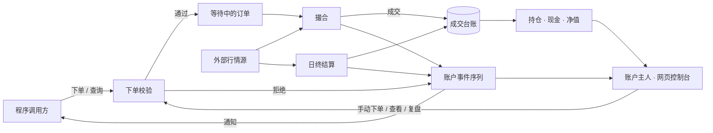
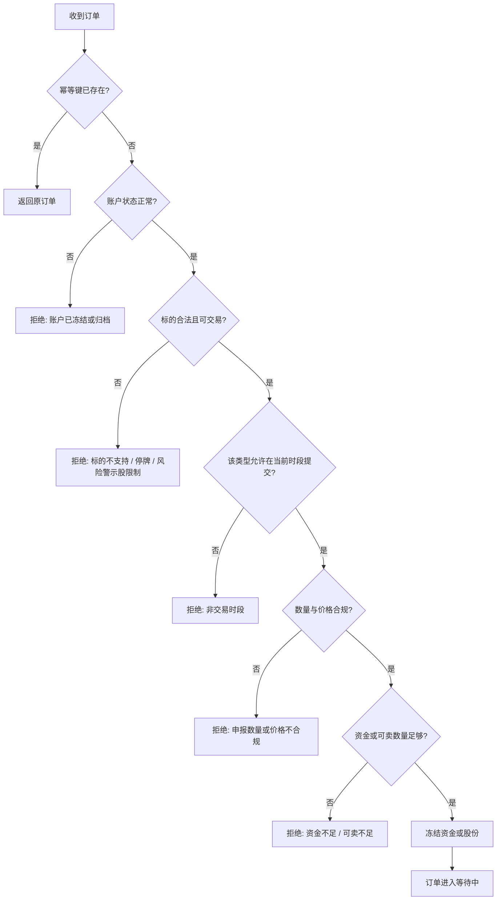
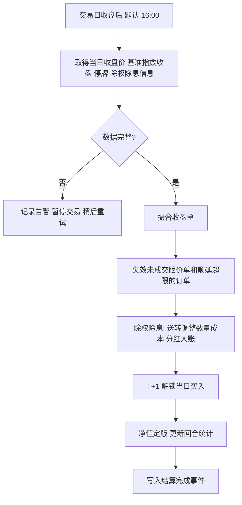
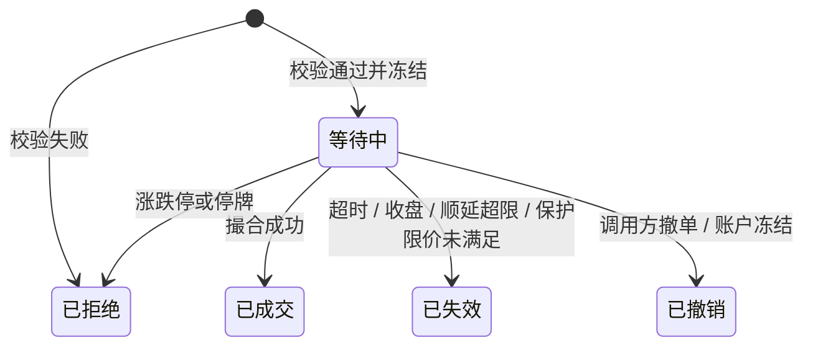

# 方案

本文档说明系统在业务上怎样满足需求：谁在什么场景下用、能做什么、一件事怎样完成、核心对象是什么、靠什么机制做到、必须遵守什么、出问题怎么办。关键机制选择已于 2026-09-24 由发起者确认，4.4 日终结算中的结算顺序与暂停交易于 2026-09-29 补充确认；文中标注"默认"的数值是可配置的默认值，集中列在 7.1 参数默认值。

目录

1. 整体方案
2. 角色与场景
3. 用户动作与系统能力：3.1 账户管理 · 3.2 下单 · 3.3 撤单 · 3.4 查询 · 3.5 事件通知 · 3.6 网页控制台
4. 核心业务流程：4.1 下单与校验 · 4.2 盘中撮合 · 4.3 开盘撮合 · 4.4 日终结算 · 4.5 账务核对与冲正 · 4.6 服务重启恢复
5. 核心对象：5.1 账户 · 5.2 订单 · 5.3 成交台账 · 5.4 持仓 · 5.5 每日净值 · 5.6 账户事件序列
6. 功能与机制：6.1 资金与股份冻结 · 6.2 T+1 与可卖数量 · 6.3 成交价与滑点 · 6.4 费用计算 · 6.5 涨跌停价 · 6.6 行情快照 · 6.7 幂等 · 6.8 估值与净值 · 6.9 回合统计 · 6.10 留痕与通知投递 · 6.11 风险警示股限制
7. 规则与约束：7.1 参数默认值 · 7.2 规则
8. 异常与边界：8.1 下单阶段 · 8.2 撮合阶段 · 8.3 结算阶段 · 8.4 系统级

---

## 1. 整体方案

本系统是一个独立运行的模拟券商柜台。它维护多个互不影响的模拟账户，接受程序和人提交的订单，用真实行情按沪深 A 股规则撮合，把每一笔成交写入只增不改的成交台账，由台账推导持仓、现金和净值，并在每个交易日收盘后统一结算、定版净值。账户上发生的每一件事都进入该账户的事件序列，既用于主动通知调用方，也用于事后复盘。程序通过接口使用它，人通过网页控制台使用它，两者走完全相同的规则。

系统由六个部分组成：

- **账户簿记**：账户、成交台账、持仓、现金、净值的记录与推导。
- **订单撮合**：校验订单，在正确的时机以正确的价格成交或拒绝。
- **行情接入**：从外部数据源取得行情快照、收盘价、交易日历、涨跌停价、停牌、风险警示名单与除权除息信息。
- **日终结算**：收盘后撮合收盘单、失效过期订单、处理除权除息、解锁 T+1、定版净值、更新统计。
- **留痕与通知**：把账户上的每件事按时间记入事件序列，并把订单结果和结算完成主动推给调用方。
- **网页控制台**：给账户主人看、操作和复盘。

---

## 2. 角色与场景

两类角色使用同一套账户和规则。程序调用方是策略程序或 AI Agent：开户后在交易时段内下单，随时查询，接收通知，收盘后拉流水和事件序列复盘。账户主人是发起者本人：在控制台看所有账户的表现和对比，手动下单验证想法或干预，评估统计，按时间线复盘每一笔决策，新建、冻结、归档账户。控制台的手动下单只是另一个入口，不享有任何特殊规则。角色需求见需求文档对应章节。

---

## 3. 用户动作与系统能力

本章按能力说明角色能做什么、系统给出什么结果。

### 3.1 账户管理

创建账户时指定名称、备注、初始资金和费用参数（佣金率、最低佣金、滑点），以及是否禁止买入风险警示股。创建后初始资金即为现金，无持仓；资金只在开户时一次注入，之后不能追加或提取。账户有正常、冻结、归档三种状态，含义与转换见 5.1 账户。费用参数创建后可以修改，只对修改之后的成交生效，并作为账户事件留痕。账户不能删除，也不能重置；想从头再来就新建一个账户。

### 3.2 下单

一笔订单包含：账户、标的、方向（买或卖）、订单类型、数量或金额（只有买入可按金额）、限价（限价单必填，收盘单可选作保护限价）、可选的幂等键、可选的备注和标签。备注和标签供调用方记录信号名称和下单理由，原样记入订单和事件序列，不影响撮合。四种订单类型：

| 类型 | 什么时候能提交 | 什么时候成交 | 成交价 | 未成交时 |
|---|---|---|---|---|
| 即时市价单 | 只在交易日连续竞价时段（9:30 至 11:30、13:00 至 14:57） | 创建之后取得的第一笔有效行情快照 | 最新价加不利滑点 | 创建后 180 秒内取不到有效快照则失效 |
| 限价单 | 随时 | 所属交易日的连续竞价时段内，最新价触及限价时 | 限价，不加滑点 | 所属交易日收盘后失效 |
| 开盘单 | 随时 | 提交后最近一次开盘；交易日 9:25 前提交算当日开盘 | 开盘价加不利滑点 | 停牌顺延，累计超过 3 个交易日失效 |
| 收盘单 | 随时 | 提交后最近一次收盘；交易日 15:30 前提交算当日收盘，在日终结算时撮合，对应真实市场的盘后固定价格交易 | 收盘价，不加滑点 | 保护限价未满足则失效；当日 15:00 仍停牌则顺延，累计超过 3 个交易日失效 |

限价单的所属交易日：在交易日 15:00 前提交的属于当日，其余属于下一个交易日。收盘单的保护限价：买入时收盘价高于限价、卖出时收盘价低于限价，订单失效并记录原因；不填则无条件按收盘价成交。按金额买入时，系统按冻结价（见 6.1 资金与股份冻结）折算成符合申报数量规则的最大数量，不足最小申报数量则拒绝。下单成功立即返回订单编号和状态；校验失败立即返回拒绝原因。

### 3.3 撤单

只有等待中的订单可以撤销。撤销后释放冻结的资金或股份，并产生撤销事件。已成交、已拒绝、已失效的订单不可撤销，已成交只能反向交易。

### 3.4 查询

- **账户概览**：现金、可用现金、冻结资金、持仓市值、总资产、净值、当日盈亏、状态。
- **持仓**：每个标的的数量、可卖数量、平均成本、最新价、市值、浮动盈亏、占比。
- **订单与成交**：订单按状态、标的、时间范围查询，含备注和标签；成交按标的、时间范围分页查询。
- **事件序列**：按编号区间、类型、标的、时间范围拉取账户事件，每条带当时依据，见 5.6 账户事件序列。
- **净值序列**：每个交易日的定版记录和基准净值。
- **市场状态**：当前是否交易日、处于什么时段、下一次开盘和收盘时间，是否因结算未完成而暂停交易（见 4.4 日终结算）；某标的的最新快照、前收盘价、涨跌停价、是否停牌、是否风险警示股、所属板块。

盘中查询到的市值、总资产和净值按最新快照估算，与定版值有区别，见 6.8 估值与净值。

### 3.5 事件通知

系统在以下时刻主动推送给调用方：订单成交、订单在撮合或结算阶段被拒绝、订单失效、订单撤销、日终结算完成（含定版净值）。推送的内容就是账户事件序列中对应的事件；调用方可以按编号区间拉取任意事件补漏。投递保证见 6.10 留痕与通知投递。

### 3.6 网页控制台

- **总览页**：所有账户的卡片（总资产、当日盈亏、累计收益、状态），多账户净值曲线对比图，可叠加基准指数。
- **账户页**：账户概览、持仓表（行内可直接卖出）、订单与成交流水（按标的和时间筛选）、净值曲线与基准对比、回合统计。
- **复盘页**：按账户展示事件序列时间线，可按标的、时间和事件类型筛选，点开一条看当时的行情依据、原因和备注；净值曲线上标出每笔买入和卖出，点标记跳到对应事件。
- **下单面板**：选择账户和标的，选类型、方向、数量或金额、限价或保护限价，填备注和标签；提交前显示将冻结的金额和预估费用，资金不足时提前提示。
- **账户管理**：新建，编辑名称、备注和费用参数，冻结与恢复，归档。

---

## 4. 核心业务流程

本章按时间顺序说明一笔订单从提交到结算的完整过程，以及核对和恢复两个保障流程。

### 4.1 下单与校验

校验按图中顺序进行。标的合法指沪深 A 股股票或 ETF，且能取到板块、前收盘价和停牌状态；风险警示股的限制见 6.11 风险警示股限制。数量与价格合规包括：申报数量规则（需求跨角色规则 1.3 申报数量）、限价在所属交易日的涨跌停区间内、价格符合最小变动单位。校验失败的订单以"已拒绝"记录并返回原因，不进入撮合，不产生冻结。无论通过还是拒绝，都写入账户事件序列并带上校验所依据的行情。

### 4.2 盘中撮合

交易日连续竞价时段内，系统按快照周期获取"有等待中订单的标的"和"有持仓的标的"的行情快照，然后逐笔处理等待中的即时单和限价单：

1. 快照无效（缺失、过期、价格为零、早于订单创建时间）：本轮跳过；即时单自创建起累计等待超过 180 秒则失效，原因"行情缺失"。
2. 标的停牌：即时单拒绝；限价单继续等待。
3. 即时单：买入时最新价已达涨停价、卖出时已达跌停价则拒绝；否则按 6.3 成交价与滑点成交。
4. 限价单：买入且最新价不高于限价，或卖出且最新价不低于限价，按限价成交；否则继续等待。

成交后：写入成交台账，按实际成交金额和费用结算，释放多冻结的部分，更新持仓，写入成交事件（带所用快照）。

### 4.3 开盘撮合

每个交易日 9:30 之后，系统取得所有开盘单涉及标的的第一笔快照，用其中的当日开盘价撮合：停牌则顺延到下一交易日，累计顺延超过 3 个交易日失效；买入开盘价等于涨停价、卖出等于跌停价则拒绝；否则按开盘价加滑点成交。开盘撮合每个交易日执行一次。

### 4.4 日终结算

- **撮合收盘单**：按当日收盘价成交，不加滑点；当日 15:00 仍停牌则顺延；带保护限价且未满足则失效；买入收盘价等于涨停价、卖出等于跌停价则拒绝。
- **失效**：所属交易日为当日且仍等待中的限价单失效；顺延次数超限的开盘单和收盘单失效。释放全部冻结。
- **除权除息**：对当日为除权除息日的持仓标的，送转股按比例增加数量，每股成本按总成本不变摊薄；现金分红按税前金额在派息日计入现金。每一项都作为"公司行动"记录写入成交台账，保证净值曲线连续。
- **T+1 解锁**：当日买入的数量转为可卖。
- **净值定版**：总资产 = 现金 + 每个持仓的数量 × 当日收盘价，停牌标的用最近有效收盘价；净值 = 总资产 / 初始资金；同时记录基准指数当日收盘归一化后的基准净值。
- **幂等**：每个交易日只结算一次，重复执行不重复记账；非交易日不结算。
- **顺序**：交易日严格按日期顺序结算，前一个交易日没有完成时不结算后一个。
- **数据不完整**：缺收盘价、缺除权信息或缺基准时，本日结算暂停并告警，之后持续自动重试直到完成，不用错误或缺失的数据定版。
- **结算未完成时暂停交易**：只要存在已过结算时间而尚未完成结算的交易日，系统就不接受新订单、不撮合，直到这些交易日按顺序补齐。撤单和查询不受影响，盘中估值仍按最新快照更新。服务重启后的补跑（见 4.6 服务重启恢复）也按这条规则处理。

### 4.5 账务核对与冲正

成交台账是唯一事实来源。持仓和现金随时可以由台账从头重放得到；每次日终结算都做一次重放核对，发现与当前记录不一致时告警，不自动修改。任何账务修正都通过新增一条"冲正"记录完成，不修改、不删除已有记录；冲正后重算受影响日期的定版净值和统计，并写入冲正事件。

### 4.6 服务重启恢复

启动时加载全部账户；等待中的订单继续等待撮合，即时单按创建时间判断是否已超过等待时限；检查自上次结算以来错过的交易日，按日期顺序补跑日终结算，补跑需要对应日期的收盘价与除权数据；补跑完成前按 4.4 日终结算 的规则暂停交易。

---

## 5. 核心对象

本章定义方案中反复出现的六个对象及其状态。

### 5.1 账户

账户包含：编号、名称、备注、初始资金、费用参数（佣金率、最低佣金、滑点）、是否禁买风险警示股、状态、创建时间。现金、冻结资金、持仓、总资产、净值由成交台账和冻结记录推导。

| 状态 | 含义 | 转换 |
|---|---|---|
| 正常 | 可下单 | 可冻结，可归档 |
| 冻结 | 拒绝所有新订单，进入冻结时所有等待中订单自动撤销；持仓和记录只读 | 可恢复为正常，可归档 |
| 归档 | 永久只读，默认列表中隐藏，仍可查看历史 | 不可逆 |

### 5.2 订单

订单包含：编号、账户、标的、方向、类型、数量（按金额下单时为折算后的数量，同时保留原始金额）、限价或保护限价、幂等键、备注、标签、所属交易日、顺延次数、状态、拒绝或失效原因、创建时间、结束时间。

第一版不做部分成交：订单要么全部成交，要么不成交。

### 5.3 成交台账

每条记录：全局递增序号、时间、账户、标的、类型（交易、公司行动、冲正）、方向、数量、价格、成交金额、佣金、印花税、过户费、净现金变动、关联订单、备注。记录只增不改不删。

### 5.4 持仓

每个账户每个标的：总数量、可卖数量、今日买入数量、平均成本（含买入费用的摊薄成本）、最新价、市值、浮动盈亏。由台账推导，日终核对。

### 5.5 每日净值

每个账户每个交易日一条：日期、现金、持仓市值、总资产、净值、当日盈亏、基准净值。收盘后定版；只有在冲正后才重算。

### 5.6 账户事件序列

每个账户一条按编号递增、只增不改的事件序列，是需求跨角色规则 2.7 完整留痕的载体。每条事件包含：账户内递增编号、类型、时间、关联对象（订单、成交、结算日期）、当时依据、结果摘要；订单相关事件带订单的备注和标签。

| 事件类型 | 何时产生 | 当时依据 |
|---|---|---|
| 订单提交、订单拒绝 | 下单校验通过或失败 | 校验所用的快照价与时间、前收盘价、涨跌停价、停牌与风险警示状态、拒绝原因 |
| 订单成交 | 盘中、开盘或结算撮合成交 | 所用快照或收盘价、成交价、费用 |
| 订单撤销、订单失效 | 撤单、账户冻结、超时、收盘、顺延超限、保护限价未满足 | 原因，失效时所用的价格 |
| 结算完成 | 日终结算结束 | 定版净值、基准净值，以及当日收盘单成交、订单失效、订单停牌顺延与公司行动的汇总 |
| 公司行动、冲正 | 结算处理除权除息、人工冲正 | 除权除息参数或冲正说明 |
| 账户创建、冻结、恢复、归档、费用参数变更 | 账户管理动作 | 变更前后的值 |

---

## 6. 功能与机制

本章说明支撑上述能力和流程的关键机制。

### 6.1 资金与股份冻结

买单进入等待中时冻结资金 = 数量 × 冻结价 + 按冻结价计算的预估费用。冻结价：限价单为限价；带保护限价的收盘单为保护限价；即时单、开盘单和不带保护限价的收盘单为所属交易日的涨停价，与真实券商对市价委托的处理一致；所属交易日尚未开始时，用最近一个前收盘价推算涨停价。成交后按实际金额结算，多冻结的部分释放。卖单冻结对应数量的可卖股份。撤销、拒绝、失效都释放冻结。可用现金 = 现金 − 冻结资金；可卖数量 = 持仓数量 − 今日买入数量 − 卖单冻结数量。按金额买入时用冻结价折算数量。

### 6.2 T+1 与可卖数量

买入成交的数量记为"今日买入"，当日不可卖，日终结算时解锁。送转股到账当日即可卖。

### 6.3 成交价与滑点

- **即时单**：最新价 × (1 + 滑点) 买入、× (1 − 滑点) 卖出；结果按最小变动单位向不利方向取整；不越过涨跌停价。
- **开盘单**：开盘价按同样方式处理。
- **限价单**：按限价成交，不加滑点。
- **收盘单**：按收盘价成交，不加滑点，对应真实市场的盘后固定价格交易；保护限价只决定成不成交，不改变成交价。

### 6.4 费用计算

| 费用 | 股票 | ETF | 方向 |
|---|---|---|---|
| 佣金 | 成交金额 × 佣金率，不低于最低佣金 | 同股票 | 双向 |
| 印花税 | 成交金额 × 0.05% | 免 | 只在卖出 |
| 过户费 | 成交金额 × 0.001% | 免 | 双向 |

每项费用按分四舍五入。佣金率和最低佣金按账户参数，默认取需求跨角色规则 1.10 佣金中发起者的实际费率。费率随外部规定变化时按生效日期更新，历史成交不重算。

### 6.5 涨跌停价

涨停价 = 前收盘价 × (1 + 幅度)，跌停价 = 前收盘价 × (1 − 幅度)，按最小变动单位四舍五入。幅度按需求跨角色规则 1.5 涨跌幅限制：主板股票 10%（含风险警示股），创业板与科创板 20%，新股上市前 5 个交易日不设，ETF 10%，交易所公布的 20% 名单内的 ETF 为 20%。行情源直接提供涨跌停价时以行情源为准。

### 6.6 行情快照

快照包含标的、时间、最新价、今开、前收、最高、最低、涨跌停价（若有）、停牌标志。盘中按快照周期获取，只获取有等待中订单或有持仓的标的。快照超过有效期不用于撮合；快照时间早于订单创建时间的不用于撮合该订单，避免用旧价成交。快照周期受行情源限流约束，默认 60 秒，行情源允许时可以调短。

### 6.7 幂等

调用方下单时可带幂等键。同一账户内同一幂等键的重复请求返回第一次创建的订单，不创建新订单。幂等键至少保留 7 天。

### 6.8 估值与净值

盘中估值用最新快照价，无快照时用前收盘价，只用于展示和查询，标注为估算。日终定版用当日收盘价，停牌标的用最近有效收盘价。基准指数从账户创建日起归一化为 1。当日盈亏 = 当日总资产 − 前一个定版总资产，盘中用估算总资产。

### 6.9 回合统计

按标的先进先出配对：每次卖出与该标的最早未平的买入配对形成回合，记录开仓日、平仓日、数量、买入成本（含费用）、卖出净额（扣费用）、收益、持有交易日数。指标：胜率 = 盈利回合数 / 全部回合数；盈亏比 = 平均盈利 / 平均亏损；平均持有天数；最大回撤按定版净值序列；累计收益 = 净值 − 1；年化收益按自然日折算，账龄不足 30 天时只显示累计收益。公司行动记录不形成回合，但改变后续配对的数量与成本。

### 6.10 留痕与通知投递

账户上的每个动作都先写入账户事件序列（见 5.6 账户事件序列），与对应的账务变更一起生效，不会出现有账务变更而无事件、或有事件而无账务变更的情况。写入后，属于 3.5 事件通知范围的事件推送给调用方。投递保证至少一次，失败后按递增间隔重试；调用方按事件编号去重，并可按编号区间拉取补漏。推送失败不影响账务。

### 6.11 风险警示股限制

标的名称含 ST 或 *ST 视为风险警示股。账户开启"禁止买入"时（默认开启，账户级可关闭）拒绝买入，已持有的可以卖出。无论开关状态，风险警示股都按需求跨角色规则 1.7 处理：只接受限价单和带保护限价的收盘单，即时市价单和开盘单拒绝；同一账户当日累计买入同一只风险警示股（已成交加等待中）不超过 50 万股，超出拒绝。

---

## 7. 规则与约束

本章先列全部可配置参数的默认值，再按能力和流程的顺序列出必须遵守的规则，全局规则放在最后。

### 7.1 参数默认值

| 参数 | 默认值 | 级别 |
|---|---|---|
| 初始资金 | 1,000,000 元 | 账户，创建时指定，不低于 10,000 元 |
| 佣金率 | 万分之 1.3 | 账户 |
| 最低佣金 | 5 元 | 账户 |
| 滑点 | 万分之 5 | 账户 |
| 禁止买入风险警示股 | 开 | 账户 |
| 快照周期 / 有效期 | 60 秒 / 180 秒 | 系统，受行情源能力限制，最慢分钟级 |
| 即时单等待行情上限 | 180 秒 | 系统 |
| 开盘单、收盘单最多顺延 | 3 个交易日 | 系统 |
| 日终结算时间 | 16:00 | 系统 |
| 通知重试次数 | 5 次 | 系统 |
| 幂等键保留 | 7 天 | 系统 |
| 基准指数 | 沪深 300 | 系统 |

### 7.2 规则

- **账户**：不可删除，不可重置；资金只在开户时注入；冻结时撤销全部等待中订单；费用参数修改只影响之后的成交并留痕。
- **下单**：标的限沪深 A 股股票与 ETF；各订单类型的提交时段按 3.2 下单的表；申报数量按需求跨角色规则 1.3 申报数量；限价和保护限价须在所属交易日涨跌停区间内且符合最小变动单位；按金额只用于买入；卖出不得超过可卖数量；买入冻结按 6.1 资金与股份冻结；备注和标签只记录不参与任何判断。
- **撮合**：成交价按 6.3 成交价与滑点；涨跌停和停牌按 4.2 至 4.4 各流程；不做部分成交；成交价格只能来自真实行情快照或收盘价。
- **结算**：每个交易日只结算一次，按日期顺序进行；数据不完整不定版；结算未完成期间暂停交易；除权除息按 4.4 日终结算；台账重放核对不一致只告警不自动改。
- **统计**：只用定版净值和已完成回合；盘中估算值不参与。
- **留痕**：每个账务变更都伴随一条事件；事件只增不改，带当时依据。
- **全局**：所有时间按北京时间；交易日历以交易所公布为准；成交台账只增不改不删，修正只能冲正。

---

## 8. 异常与边界

本章按下单、撮合、结算、系统四个阶段列出异常情况及处理。

### 8.1 下单阶段

- **重复提交**：带同一幂等键的返回原订单；不带幂等键的重复请求视为两笔独立订单。
- **标的不支持**：北交所、B 股、非 ETF 基金、债券等一律拒绝。
- **标的信息缺失**：取不到板块、前收盘价或停牌状态时拒绝，原因"标的信息缺失"。
- **账户冻结或归档**：拒绝。
- **结算未完成**：存在已过结算时间而未完成结算的交易日时不接受新订单，返回待结算的日期，见 4.4 日终结算。
- **风险警示股**：按 6.11 风险警示股限制拒绝的，原因写明是禁买、订单类型不允许还是超过当日买入上限。
- **新股无涨跌停**：上市前 5 个交易日的标的，市价类订单冻结价用前收盘价的 2 倍估算，成交按实际价格结算。

### 8.2 撮合阶段

- **行情缺失或过期**：本轮跳过；即时单超时失效；限价单继续等到所属交易日收盘失效；开盘单当日取不到开盘价按停牌顺延。
- **快照异常值**：价格为零、为负或超出涨跌停区间的快照视为无效。
- **盘中临时停牌**：即时单拒绝，限价单继续等待到收盘失效。
- **涨跌停**：即时单和开盘单拒绝并留痕，限价单继续等待，见 4.2 盘中撮合。
- **成交时可用现金不足**：正常情况下不会发生，因为冻结按涨停价或限价；若因冲正导致现金异常，拒绝并告警。

### 8.3 结算阶段

- **缺收盘价、除权信息或基准**：本日结算暂停并持续自动重试，期间暂停交易（见 4.4 日终结算）；持续超过 1 个交易日未完成时在控制台显著提示；账户不定版，盘中估值仍可看。
- **收盘单遇停牌**：当日 15:00 仍停牌则顺延，超限失效。
- **收盘单保护限价未满足**：失效，事件中记录当日收盘价和限价。
- **错过结算**：服务未运行导致错过的交易日，启动后按顺序补跑，见 4.6 服务重启恢复。
- **重复结算**：幂等，不重复记账。
- **除权信息迟到**：结算后才发现当日有除权时，以公司行动冲正记录补记，重算当日及之后的定版净值，并告警。

### 8.4 系统级

- **重启**：按 4.6 服务重启恢复。
- **通知失败**：按 6.10 留痕与通知投递重试；账务不受影响。
- **台账与持仓不一致**：告警，不自动改，由账户主人决定是否冲正。
- **交易日历未覆盖当前日期**：不撮合不结算，告警。
- **系统时钟异常**：与北京时间偏差过大时拒绝下单并告警。
